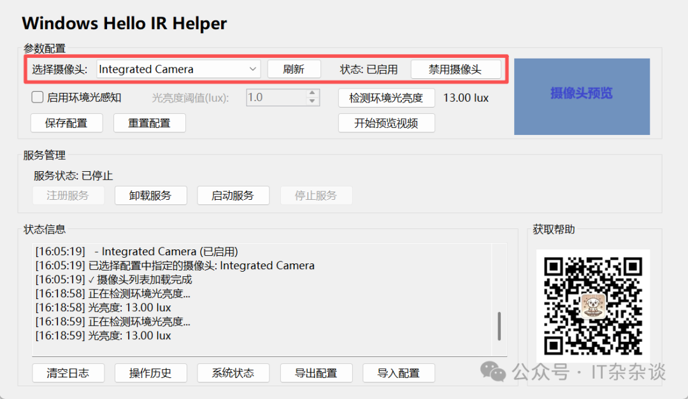

**Annoying Windows 11 24H2 "Feature"? Restore Easy Face Unlock in Low Light with This Tool!**

Many users, including myself, encountered a frustrating "BUG" after upgrading to Windows 11 24H2: **Windows Hello Face Unlock consistently fails in low-light environments!**

Endless failures without a clear reason... until we discovered it's not a BUG, it's a **FEATURE**! How's that for a plot twist?

As a seasoned developer, I simply couldn't accept this. Face unlock is, hands down, the most convenient – almost "invisible" – authentication method. If you haven't experienced it, sticking with PIN/password or fingerprint might seem seamless. But once you've tried effortless face unlock, it's hard to go back.

Don't worry, let's first break down the story behind this "FEATURE."

---

### 📅 The Origin: A Security Update "For Your Own Good"

This all started with the April 2025 Patch Tuesday update. After installing it, users found Windows Hello Face Recognition stopped working reliably in dimly lit rooms.

The core change was in its operational logic:

* **Before:** Windows Hello primarily relied on the **Infrared (IR) sensor** to create a 3D facial map for authentication. Since IR isn't affected by visible light, unlocking worked flawlessly even in pitch darkness.
* **After:** The system now **requires both the IR sensor and the color camera** to be enabled. Both must "see" your face to complete the login process.

---

### 🔒 The Core Reason: The Security vs. Convenience Trade-Off

Microsoft's move wasn't an accidental "Bug" but a deliberate security strategy to patch a vulnerability (**CVE-2025-26644**) and enhance the anti-spoofing capabilities of facial recognition.

This vulnerability, disclosed by researchers at Nanyang Technological University, highlighted a weakness in Windows Hello's mechanism against "adversarial input perturbations." Essentially, an attacker could potentially bypass local authentication using specially crafted fake images.

Think of it this way: Using only the IR sensor was like using one key to open a door. The dual verification (IR + Color) now requires both a key and an access card, significantly boosting security. However, since most devices' color cameras lack a fill light and depend on ambient light, unlocking fails in low-light conditions.

---

### 🛠️ The Popular Workaround & Its Trade-Offs

A primary temporary solution has been circulating online, but it comes with significant compromises.

**The Solution: The Camera Disable Fallback Method**

* **How-to:** Disable the built-in color camera via Device Manager.
* **Pro:** Immediately restores the ability to unlock using the IR sensor alone in the dark.
* **Con:** Major Side Effect: Once disabled, **all camera-dependent functions (like video calls, meetings, photography) will be unavailable.**

**Please Note:** This is merely a stopgap measure, and Microsoft might block this fallback path in a future update.

---

### 📢 Community Feedback & Official Stance

* **Users & Community:** This change has sparked significant dissatisfaction among users, especially those who work/study at night or frequently use their PCs in poorly lit environments. The general consensus is that it undermines one of Windows Hello's most practical core advantages – the convenience of seamless, "invisible" unlocking.
* **Microsoft Official Stance:** Microsoft has clearly stated this is an **intentional feature change designed to enhance security**, not a system malfunction. Therefore, there is no "fix" coming – this is now the intended behavior of Windows Hello.

---

Alright, enough talk. Where's the promised remedy? Don't worry, here comes the good stuff. Unable to tolerate this "FEATURE," I rolled up my sleeves and developed a small tool to fight magic with magic.

Oh, this pic above is out, there is also an i18n new version (1.0.0).

### 🛠️ How It Works

The tool intelligently detects lock/unlock events. It **automatically disables the color camera when the screen locks and re-enables it upon successful unlock**, eliminating the hassle of manual toggling. This process aims to be seamless, throwing the low-light unlock frustration into the trash bin.

---

### ⚠️ Known Risks & Considerations

1. **Security Trade-Off:** While there are currently no known real-world attacks exploiting CVE-2025-26644, we acknowledge its theoretical threat. The cost to execute such an attack is considered very high. For the average user, the practical risk is virtually zero. **HOWEVER, if your computer contains critical commercial secrets or state secrets, DO NOT use this software. DO NOT. DO NOT.** Consider yourself warned; I have fulfilled my duty to inform.
2. **Future-Proofing:** If Microsoft ever implements a better solution that allows low-light unlocking *while* preventing CVE-2025-26644 attacks, or if they forcefully block this workaround, this tool will have served its purpose. Please uninstall it promptly and forget it ever existed.

---

### 🧩 Software Components

1. **Configuration & Debug Interface:** `WindowsHelloIRHelper.exe`
2. **Automation Windows Service:** You can find it in Service Manager as **"Auto Camera Control Service (AutoCameraControlService)"**.

---

### 📖 How to Use

**0. Prerequisites:** Windows 10 or 11, with the **.NET 8.0 (or 9.0) Runtime** installed. If you're a developer, you probably already have this. If not, download it from: `https://dotnet.microsoft.com/en-us/download/dotnet/8.0`

1. **Download:** Download it from Releases of this repo.
2. **Extract & Run:** Unzip the downloaded package to a permanent location (it's portable). Run `WindowsHelloIRHelper.exe`.
    **※ Important:** Do not move this folder after setup.
3. **Select Camera:** Choose your color camera (the first one is usually pre-selected, which is typically the built-in webcam on laptops).
    
    
4. **Configure Ambient Light Sensing (Optional):**
    * **Why?** While toggling the camera on lock/unlock solves the core issue, why add ambient light sensing? Frankly, due to potential Windows/driver bugs, repeatedly disabling/enabling the camera *might* occasionally cause the device to malfunction, requiring a system reboot – which is annoying if you, like me, rarely reboot.
    * **How?** If enabled, the tool will only disable the camera in low light, reducing potential device state issues. Use the **"Start Video Preview"** and **"Detect Ambient Light"** buttons to find a suitable LUX threshold for your device (e.g., I set mine to 10 LUX for a ThinkBook 14 2024).
    * **The Catch:** If ambient light sensing is ON and you lock the screen in a bright room, the camera *won't* be disabled. If the light dims before you unlock, face unlock might fail.
    * **My Recommendation:** I prefer **disabling** ambient light sensing, as device state bugs from frequent toggling are relatively rare. Keep it simple.

5. **Save Configuration:** After selecting your camera and setting your light preference, click **"Save Config"**. This creates `C:\ProgramData\AutoCameraControl\config.json` for the background service.
6. **Register Service:** Ensure you won't move the folder, then click **"Register Service"**. This installs the background Windows Service.
    
7. **Start Service:** After registration, click **"Start Service"**. Wait a few seconds for the status to show "Running". Congratulations! Now test face unlock in low light – it should be back!
    * **Troubleshooting:** If you encounter errors, check the log file at `C:\Windows\System32\config\systemprofile\AppData\Local\AutoCameraControl\Logs\AutoCameraControl_YYYYMMDD.log`. If you can't resolve the issue yourself, you can try to send it to me via the official account. However, a fair warning: PC environments vary wildly, and as a busy developer, I may not have the capacity to provide individual support, though I'll do my best.
8. **Done!** You can now close the window. The tool will work silently in the background.

**This tool does NOT collect any private data, does NOT connect to the internet, and contains NO backdoors, trojans, or viruses.** It just does its job. (This applies only if you downloaded it from the official source provided by this account. I am not responsible for copies obtained elsewhere.)

---

### 🎯 Quick Setup Summary

If the details above were too much, here's the simplified version:

**⚠️ Important Note on Moving the Folder:**
If you *must* move the tool's folder later, you **must** first: Run `WindowsHelloIRHelper.exe` -> **Stop Service** -> **Uninstall Service** -> Close the program -> Move the folder -> Re-run the program -> **Register Service** -> **Start Service**. Forcing a move will break the service.
